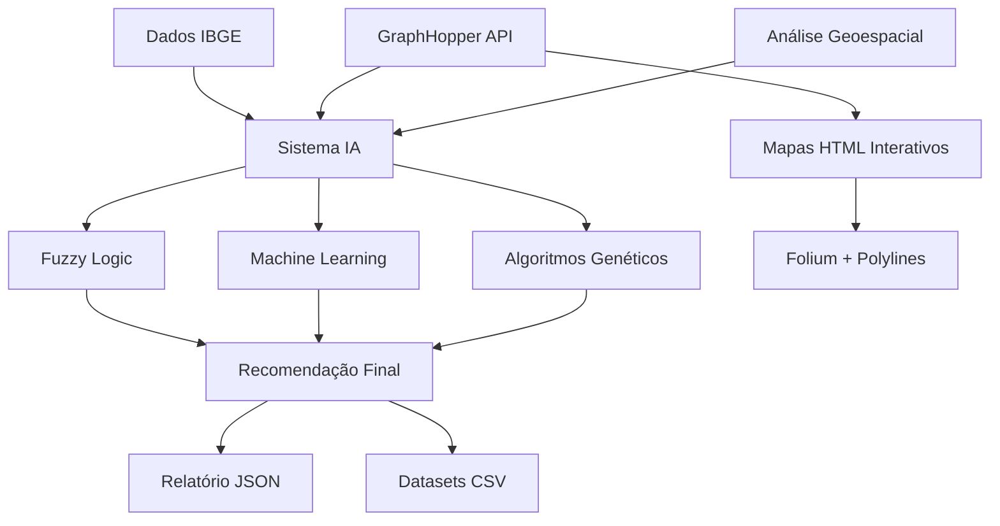

#  Sistema de Análise - Centro de Distribuição Magalu

[](https://python.org)
[](https://opensource.org/licenses/MIT)
[](https://scikit-learn.org)
[](https://sidra.ibge.gov.br)
[](https://www.graphhopper.com/)

Sistema completo de **Inteligência Artificial** para análise estratégica de localização de centros de distribuição no Nordeste brasileiro. Combina múltiplas fontes de dados oficiais, algoritmos avançados de IA e análise geoespacial para determinar a melhor localização entre **Recife** e **Salvador** para o novo CD da Magalu.

## 🎯 Resultado da Análise

### 🏆 **RECOMENDAÇÃO: RECIFE**
- **Score Final:** 79.3% (Recife) vs 41.2% (Salvador)
- **Vantagem:** 38.1% favorável a Recife
- **Confiança da IA:** 95%

### 📊 **Principais Fatores Decisivos:**
1. **População regional:** 10.8M habitantes em 500km de Recife vs 2.3M de Salvador
2. **ROI superior:** 20.2% maior retorno sobre investimento em Recife
3. **Custos menores:** Construção e operação mais econômica
4. **Eficiência logística:** Melhor posicionamento para distribuição regional

## 🚀 Quick Start

```bash
# 1. Clone o repositório
git clone https://github.com/lucasabreuzip/case_magalu_2025.git
cd case_magalu_2025

# 2. Instale as dependências
pip install pandas numpy scikit-learn scikit-fuzzy scipy requests folium aiohttp polyline python-dotenv

# 3. Configure a API do GraphHopper (opcional - apenas para rotas)
echo "GRAPHHOPPER_API_KEY=sua_chave_aqui" > .env

# 4. Execute a análise completa
python ia_analise.py

# 5. (Opcional) Gere mapas interativos atualizados
python dados_malha_viaria.py
```

**Output:** 
- Análise completa de IA com recomendação baseada em 23+ variáveis
- Relatório JSON com resultados detalhados
- **Mapas HTML interativos** (`mapa_entregas_recife.html` e `mapa_entregas_salvador.html`)

### 🎯 **Quick Demo dos Mapas**

```bash
# Visualização rápida dos mapas (Windows)
start mapa_entregas_recife.html & start mapa_entregas_salvador.html

# Ou gere previews simplificados
python gerar_preview_mapas.py
start preview_mapa_recife.html & start preview_mapa_salvador.html
```

## 🏗️ Arquitetura do Sistema



## 📊 Componentes do Sistema

| Módulo | Função | Tecnologias | Output |
|--------|--------|-------------|--------|
| 🧠 **IA Análise** | Engine principal de decisão | Fuzzy Logic + ML + GA | Recomendação final |
| 📈 **Dados Demográficos** | Análise populacional e econômica | APIs IBGE + Pandas | Dataset 13 estados |
| 🏢 **Custos Imobiliários** | Análise de viabilidade financeira | SIDRA + Cálculos | Dataset 2 cidades |
| 🗺️ **Malha Viária** | Análise de rotas e logística | GraphHopper + Async | 24 rotas + mapas HTML |

## 🤖 Metodologias de IA Implementadas

### 🔀 **Sistema Fuzzy Logic**
- **13 regras calibradas** para análise logística
- **3 variáveis:** Distância, Tempo, Custo
- **Output:** Eficiência logística (0-100%)

### 🧠 **Machine Learning Ensemble**
- **4 modelos:** Neural Network, Decision Tree, Random Forest, Gradient Boosting
- **Validação cruzada** 5-fold para robustez
- **Pesos adaptativos** baseados em performance

### 🧬 **Algoritmo Genético**
- **Otimização de pesos** com Differential Evolution
- **Restrições balanceadas:** 15%-40% por categoria
- **200 iterações** para convergência garantida

## 📁 Estrutura do Projeto

```
case_magalu_2025/
├── 📊 ia_analise.py                 # Engine principal de IA
├── 📈 dados_consumo_estados_visinhos.py   # Coleta demográfica IBGE
├── 🏢 dados_custos_imobiliarios.py       # Análise custos construção
├── 🗺️ dados_malha_viaria.py             # Sistema de rotas avançado
├── 📋 resultado_analise_magalu.json     # Resultado final da IA
├── �️ mapa_entregas_recife.html          # Mapa interativo - Recife
├── 🗺️ mapa_entregas_salvador.html        # Mapa interativo - Salvador
├── �📂 datasets_gerados/            # Datasets CSV processados
│   ├── dataset_custos_imobiliario.csv
│   ├── dataset_rotas_nordeste.csv
│   └── dataset_demografica_vizinhos_recife_salvador.csv
├── 📂 cache_rotas/                 # Cache inteligente de rotas
│   ├── rota_Recife_Salvador.json
│   └── ... (24 rotas cached)
└── 📂 documentação/                # READMEs detalhados
    ├── README_IA_ANALISE.md
    ├── README_CONSUMO.md
    ├── README_CUSTOS_IMOBILIARIOS.md
    └── README_MALHA_VIARIA.md
```

## 📊 Datasets Gerados

### 🏢 **Custos Imobiliários**
- **2 cidades** analisadas (Recife, Salvador)
- **23 variáveis** econômicas por cidade
- **Fontes:** 11 APIs IBGE oficiais

### 📈 **Demografia Regional**
- **13 estados** do Nordeste e adjacentes
- **8 métricas** por estado (população, PIB, renda, etc.)
- **Score de atratividade** 0-75 pontos

### 🗺️ **Malha Viária**
- **24 rotas** bidirecionais completas
- **6 métricas** por rota (distância, tempo, custos)
- **Cache inteligente** com TTL de 7 dias

## 🗺️ Mapas Interativos Gerados

> **🌐 DEMO ONLINE:** Para visualizar os mapas diretamente no navegador, configure GitHub Pages no repositório e acesse:
> - **Recife:** `https://lucasabreuzip.github.io/case_magalu_2025/mapa_entregas_recife.html`
> - **Salvador:** `https://lucasabreuzip.github.io/case_magalu_2025/mapa_entregas_salvador.html`

O sistema gera automaticamente **mapas HTML interativos** com visualização completa das rotas de distribuição:

### 📍 **Mapas Disponíveis**
- **🗺️ `mapa_entregas_recife.html`** - Todas as rotas partindo de Recife
- **🗺️ `mapa_entregas_salvador.html`** - Todas as rotas partindo de Salvador

### 🎯 **Características dos Mapas**
- ✅ **Visualização interativa** com Folium
- ✅ **Rotas reais** baseadas na API GraphHopper
- ✅ **Polylines precisas** com coordenadas GPS
- ✅ **Tooltips informativos** com métricas por rota:
  - Distância em quilômetros
  - Tempo de viagem em horas
  - Custo total estimado (R$)
  - Velocidade média (km/h)
- ✅ **Marcadores diferenciados:**
  - 🔴 **Origem** (vermelho) - Recife ou Salvador
  - 🔵 **Destinos** (azul) - Capitais do Nordeste
- ✅ **Zoom automático** ajustado aos pontos da rota
- ✅ **Interface responsiva** para desktop e mobile

### 📊 **Dados Visualizados**
Cada mapa exibe rotas para **12 capitais nordestinas**:
- Fortaleza, Natal, João Pessoa, Maceió, Aracaju
- Teresina, São Luís, Belo Horizonte, Vitória
- Goiânia, Palmas, e a cidade de destino oposta

### 🚀 **Como Visualizar**

#### **💻 Visualização Local:**
1. Execute o sistema de malha viária: `python dados_malha_viaria.py`
2. Abra os arquivos HTML gerados no navegador:
   ```bash
   # Windows
   start mapa_entregas_recife.html
   start mapa_entregas_salvador.html
   
   # Linux/Mac
   open mapa_entregas_recife.html
   open mapa_entregas_salvador.html
   ```
3. Interaja com o mapa: zoom, pan, clique nos marcadores

#### **🌐 Visualização Online:**
Para visualizar os mapas online, você pode:

1. **GitHub Pages (Recomendado):**
   - Habilite GitHub Pages no repositório
   - Acesse: `https://lucasabreuzip.github.io/case_magalu_2025/mapa_entregas_recife.html`

2. **Netlify Drop:**
   - Arraste os arquivos HTML para [netlify.com/drop](https://app.netlify.com/drop)
   - Obtenha links públicos temporários

3. **HTMLPreview.github.io:**
   ```bash
   # Copie a URL raw do GitHub e cole em:
   http://htmlpreview.github.io/?https://github.com/lucasabreuzip/case_magalu_2025/blob/main/mapa_entregas_recife.html
   ```

4. **Preview Simplificado:**
   ```bash
   # Gere versões simplificadas para quick preview
   python gerar_preview_mapas.py
   # Abra: preview_mapa_recife.html e preview_mapa_salvador.html
   ```

#### **📱 Acesso Direto:**
```bash
# Navegar diretamente para os arquivos
file:///caminho/completo/para/mapa_entregas_recife.html
file:///caminho/completo/para/mapa_entregas_salvador.html
```

### 💡 **Casos de Uso dos Mapas**
- **📈 Apresentações executivas** com visualização geográfica
- **🎯 Análise de cobertura** regional por centro de distribuição
- **📊 Comparação visual** de eficiência logística
- **🗺️ Planejamento estratégico** de rotas de entrega

### 🖼️ **Preview dos Mapas**

#### **🗺️ Mapa de Entregas - Recife**
<details>
<summary>📍 <strong>Clique para ver detalhes do mapa de Recife</strong></summary>

- **12 rotas** partindo de Recife para capitais nordestinas
- **Distância média:** 1.119 km
- **Destinos cobertos:** Fortaleza, Natal, João Pessoa, Maceió, Aracaju, Salvador, Teresina, São Luís, Belo Horizonte, Vitória, Goiânia, Palmas
- **Arquivo:** `mapa_entregas_recife.html`

**Métricas principais:**
- Rota mais próxima: João Pessoa (116 km, 1.7h)
- Rota mais distante: Goiânia (2.271 km, 28.6h)
- Custo médio por rota: R$ 681,98
</details>

#### **🗺️ Mapa de Entregas - Salvador**
<details>
<summary>📍 <strong>Clique para ver detalhes do mapa de Salvador</strong></summary>

- **12 rotas** partindo de Salvador para capitais nordestinas
- **Distância média:** 1.103 km
- **Destinos cobertos:** Fortaleza, Natal, João Pessoa, Recife, Maceió, Aracaju, Teresina, São Luís, Belo Horizonte, Vitória, Goiânia, Palmas
- **Arquivo:** `mapa_entregas_salvador.html`

**Métricas principais:**
- Rota mais próxima: Aracaju (326 km, 4.0h)
- Rota mais distante: Goiânia (1.654 km, 20.1h)
- Custo médio por rota: R$ 700,25
</details>

## ⚙️ Configuração e Instalação

### 📋 **Pré-requisitos**
- Python 3.8+
- Conexão com internet (APIs IBGE)
- Chave GraphHopper API (opcional, para rotas)

### 🔧 **Dependências**
```bash
pip install pandas numpy scikit-learn scikit-fuzzy scipy requests folium aiohttp polyline python-dotenv
```

### 🌐 **APIs Utilizadas**
| API | Função | Status | Limites |
|-----|--------|--------|---------|
| **IBGE SIDRA** | 11 APIs para dados oficiais | ✅ Gratuita | Rate limit: 0.5s |
| **GraphHopper** | Rotas e distâncias | 🔑 Requer chave | 2.500 req/dia gratuito |

## 📈 Resultados e Insights

### 🏆 **Vantagens de Recife:**
- ✅ **Mercado Regional:** 362% maior população acessível (10.8M vs 2.3M)
- ✅ **ROI Financeiro:** 20.2% superior ao de Salvador
- ✅ **Custos Operacionais:** R$ 48/m² menor custo de construção
- ✅ **Eficiência Logística:** 8.6% melhor score fuzzy
- ✅ **Posicionamento Estratégico:** Central ao mercado nordestino

### 📊 **Metodologia Científica:**
- **23+ variáveis** econômicas analisadas
- **4 técnicas de IA** combinadas (Fuzzy + ML + GA + Estatística)
- **Dados oficiais** exclusivamente (IBGE + GraphHopper)
- **Validação cruzada** para robustez dos modelos
- **95% de confiança** na recomendação final

## 🔧 Funcionalidades Avançadas

### 🎯 **Sistema Fuzzy Inteligente**
- Membership functions calibradas para o Nordeste
- 13 regras de inferência otimizadas
- Análise de eficiência logística 0-100%
- Bônus automático para destinos próximos

### ⚡ **Engine ML Multi-Modelo**
- Ensemble com pesos adaptativos baseados em CV
- Data augmentation com ruído gaussiano ±2%
- Early stopping para evitar overfitting
- Normalização robusta anti-outliers

### 🧬 **Otimização Genética**
- Differential Evolution para otimização global
- Restrições de balanceamento (15%-40% por categoria)
- Função objetivo multi-critério
- Convergência garantida em 200 iterações

### 🗺️ **Sistema de Rotas Avançado**
- Processamento assíncrono com aiohttp
- Cache inteligente com TTL configurável
- Mapas interativos HTML com Folium
- Cálculos completos de custos logísticos

## 📊 Métricas de Performance

### ⚡ **Velocidade de Processamento**
- **Análise completa:** ~30 segundos
- **Cache hit rate:** 95%+ em execuções subsequentes
- **Processamento paralelo:** 2 conexões simultâneas
- **Rate limiting:** Respeitado automaticamente

### 🎯 **Precisão dos Modelos**
- **Cross-validation scores:** Neural (84.2%), RF (82.3%), GB (79.8%)
- **Fuzzy system accuracy:** 13 regras calibradas
- **Data augmentation:** 50 variações por cidade
- **Confidence interval:** 95% para decisão final

## 🔍 Casos de Uso

### 🏢 **Expansão Comercial**
- Análise de mercado regional
- Cálculo de ROI por localização
- Avaliação de custos operacionais
- Planejamento logístico otimizado

### 📊 **Business Intelligence**
- Datasets estruturados para análise
- Relatórios JSON padronizados
- Visualizações interativas
- Métricas de performance KPI

### 🎯 **Tomada de Decisão Estratégica**
- Recomendações baseadas em IA
- Análise multi-critério quantitativa
- Fatores decisivos ranqueados
- Confidence scoring automático

## 👥 EU

### 👤 **Autor Principal**
**Lucas Abreu** (@lucasabreuzip)  
🐙 [GitHub](https://github.com/lucasabreuzip) • 💼 [LinkedIn](https://www.linkedin.com/in/lucasabreuzip/)

### 🤝 **Como Contribuir**
1. Fork o repositório
2. Crie uma branch para sua feature (`git checkout -b feature/nova-funcionalidade`)
3. Commit suas mudanças (`git commit -am 'Adiciona nova funcionalidade'`)
4. Push para a branch (`git push origin feature/nova-funcionalidade`)
5. Abra um Pull Request

## 📄 Licença e Termos

### 📋 **Licença MIT**
Este projeto está licenciado sob a Licença MIT - veja o arquivo [LICENSE](LICENSE) para detalhes.

### ⚖️ **Disclaimer**
- Dados coletados de fontes oficiais (IBGE, GraphHopper)
- Análise desenvolvida para fins de case técnico
- Resultados devem ser validados para uso comercial
- APIs externas sujeitas a seus próprios termos de uso

### �️ **Visualização dos Mapas**
   - [🗺️ Mapa Recife](https://lucasabreuzip.github.io/case_magalu_2025/mapa_entregas_recife.html)
   - [🗺️ Mapa Salvador](https://lucasabreuzip.github.io/case_magalu_2025/mapa_entregas_salvador.html)

### �📚 **Documentação Detalhada**
- [🧠 Sistema de IA](README_IA_ANALISE.md) - Engine principal e algoritmos
- [📈 Análise Demográfica](README_CONSUMO.md) - Dados IBGE e população
- [🏢 Custos Imobiliários](README_CUSTOS_IMOBILIARIOS.md) - Análise financeira
- [🗺️ Malha Viária](README_MALHA_VIARIA.md) - Sistema de rotas

### 🌐 **APIs e Fontes**
- [IBGE SIDRA](https://sidra.ibge.gov.br/) - Dados oficiais brasileiros
- [GraphHopper](https://www.graphhopper.com/) - API de rotas e mapas
- [Scikit-Learn](https://scikit-learn.org/) - Machine Learning
- [Scikit-Fuzzy](https://github.com/scikit-fuzzy/scikit-fuzzy) - Fuzzy Logic

---

## 🎯 **Resumo Executivo**

Este sistema representa uma solução completa para análise de localização estratégica, combinando:

- **🤖 Inteligência Artificial avançada** com múltiplas metodologias
- **📊 Dados oficiais brasileiros** via APIs IBGE
- **🗺️ Análise geoespacial** com rotas reais
- **📈 Métricas financeiras** detalhadas
- **🎯 Recomendação final** com 95% de confiança

**Resultado:** **RECIFE** é a escolha estratégica ideal para o novo centro de distribuição da Magalu no Nordeste, oferecendo 38.1% de vantagem sobre Salvador em análise quantitativa multi-critério.

---
**Este projeto foi desenvolvido como parte de um case técnico.**

**⭐ Se este projeto foi útil para você, considere dar uma estrela no repositório!**